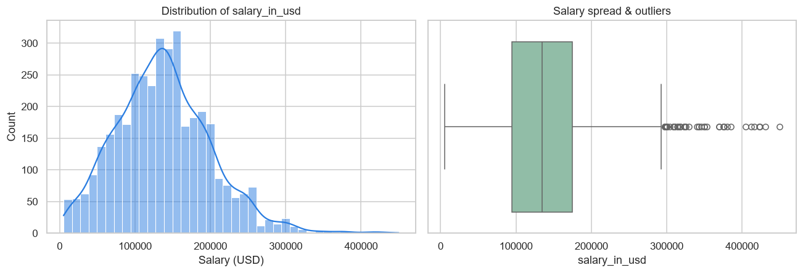
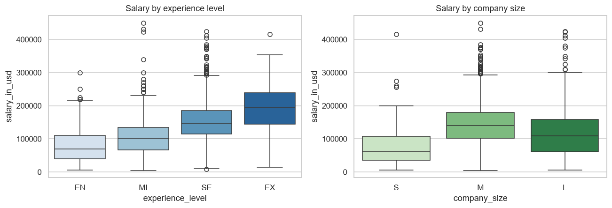
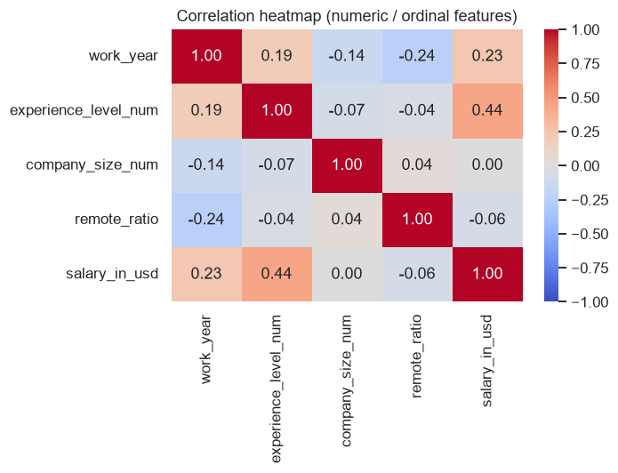
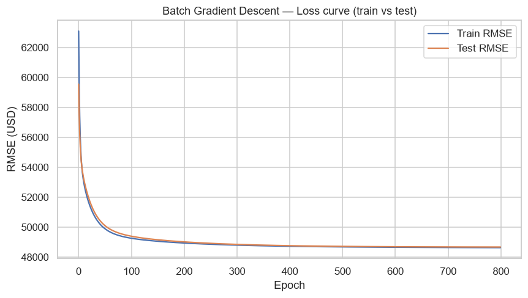
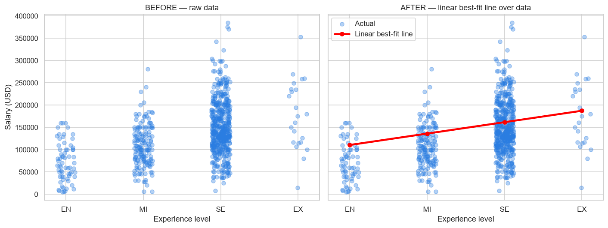

# Tech Talent Salary Prediction — Linear Regression Model Deployment

## Mission & Problem
My mission is to leverage technology to tackle **unemployment, education and access-to-tech gaps** and
promote equitable opportunity. This project powers a **talent-management platform** feature that
predicts a tech professional's **expected annual salary (USD)** from their profile, so members can
quantify the market value of their skills and the ROI of upskilling or changing roles.

## Dataset — description & source
- **Source:** *Data Science / Tech Job Salaries* dataset (Kaggle — `arnabchaki/data-science-salaries-2023`),
  redistributed CSV included at [`summative/linear_regression/data/ds_salaries.csv`](summative/linear_regression/data/ds_salaries.csv).
- **Volume & variety:** **3,755 records × 11 columns**, spanning **93 job titles**, **78 countries**,
  years **2020–2023**, four experience levels, four employment types and three company sizes — a mix of
  numeric and categorical features (rich in both volume and variety).
- **Target:** `salary_in_usd` (continuous → regression).

## Visualizations (see [`summative/linear_regression/images/`](summative/linear_regression/images))
| Target distribution | Salary by category | Correlation heatmap |
|---|---|---|
|  |  |  |

- **Right-skewed salaries** → a linear model is pulled by the high-earner tail.
- **Experience level** is the strongest, monotonic driver (→ ordinal-encoded); `company_size` similar.
- `remote_ratio` correlates ~0 with salary — kept, but expected to carry a small weight.

## Feature engineering (interpretation)
| Column | Decision | Reason |
|---|---|---|
| `salary`, `salary_currency` | **drop** | `salary_in_usd` is derived from them → **target leakage** |
| `employee_residence` | **drop** | redundant with `company_location` |
| `job_title` (93) | **group → `job_category`** (6) | reduce high cardinality into role families |
| `company_location` (78) | **top-6 + `Other`** | keep high-signal countries (US = 81% of rows) |
| `experience_level`, `company_size` | **ordinal-encode** | natural order |
| `employment_type` + engineered cats | **one-hot** | nominal, low cardinality |
| `work_year`, `remote_ratio` | **standardized** | numeric |

All preprocessing lives inside a scikit-learn `Pipeline`, so the saved model is self-contained.

## Models & results (loss metric = RMSE, lower is better)
Four models compared — **two gradient-descent linear regressors**, one **ensemble**, one **tree**:

| Model | Type | Test RMSE (USD) | Test MAE | Test R² |
|---|---|---:|---:|---:|
| **SGD Linear Regression (GD)** ⭐ | Linear – stochastic GD (sklearn) | **48,645** | 37,236 | 0.40 |
| Batch GD Linear Regression | Linear – batch GD (from scratch) | 48,672 | 37,269 | 0.40 |
| Random Forest | Ensemble | 48,968 | 37,241 | 0.39 |
| Decision Tree | Tree | 49,817 | 37,934 | 0.37 |

⭐ **Saved model:** the **SGD linear regressor** had the **lowest test RMSE** and the smallest train/test
gap (no over-fitting), so it is saved as [`summative/API/model/best_model.pkl`](summative/API/model/best_model.pkl)
and served by the API. Loss curves and the best-fit line are in the notebook:

| Loss curve (Batch GD) | Best-fit line: before → after |
|---|---|
|  |  |

## 🌐 Public API endpoint (Swagger UI)
> **Swagger UI:** `https://tech-salary-api.onrender.com/docs`
> **Predict:** `POST https://tech-salary-api.onrender.com/predict`
>
> _(Replace with your own Render URL after deploying — see below. The free tier may cold-start ~30s.)_

Example request body:
```json
{
  "work_year": 2023, "experience_level": "SE", "employment_type": "FT",
  "job_category": "Data Scientist", "company_size": "M",
  "company_location_grp": "US", "remote_ratio": 100
}
```

## 📺 Video demo
> YouTube (≤ 7 min): `https://youtu.be/REPLACE_WITH_YOUR_VIDEO`

---

## Repository layout
```
linear_regression_model/
├── pyproject.toml            # uv project (root)
├── uv.lock
├── render.yaml               # Render deployment blueprint
└── summative/
    ├── linear_regression/
    │   ├── multivariate.ipynb    # EDA, 4-model comparison, loss curves, saved model
    │   ├── data/ds_salaries.csv
    │   └── images/               # generated plots
    ├── API/
    │   ├── prediction.py         # FastAPI app (/predict, /retrain, CORS)
    │   ├── ml.py                 # shared feature-engineering + training
    │   ├── requirements.txt
    │   └── model/                # best_model.pkl, metadata, training_data.csv
    └── FlutterApp/               # single-page mobile app
```

## How to run

### 1. Notebook (train / reproduce the model)
```bash
# from linear_regression_model/
uv sync --extra notebook
uv run jupyter nbconvert --to notebook --execute --inplace \
    summative/linear_regression/multivariate.ipynb
```

### 2. API (local)
```bash
cd summative/API
uv run --project ../.. uvicorn prediction:app --reload --port 8000
# open http://localhost:8000/docs
```
Retrain (optionally upload a CSV of new labelled rows to hot-swap the best model):
```bash
curl -X POST http://localhost:8000/retrain -F "file=@new_rows.csv"
```

### 3. Deploy the API to Render
1. Push this repo to GitHub.
2. On Render → **New → Blueprint** (uses `render.yaml`), or a **Web Service** with:
   - Root directory: `summative/API`
   - Build: `pip install -r requirements.txt`
   - Start: `uvicorn prediction:app --host 0.0.0.0 --port $PORT`
3. Copy the public URL and update `kApiBaseUrl` in the Flutter app + the URLs above.

### 4. Mobile app (Flutter)
```bash
cd summative/FlutterApp
flutter pub get
# Edit lib/main.dart -> set kApiBaseUrl to your deployed Render URL
#   (Android emulator + local API: use http://10.0.2.2:8000)
flutter run                 # on a connected device / emulator
```
Enter a profile in the 7 fields → tap **Predict** → the predicted salary (or a validation error) appears.

## CORS configuration rationale
The API uses `CORSMiddleware` deliberately scoped (not a blanket `*`):
- **Allowed origins:** only the deployed API host, the Flutter web dev server and localhost tooling —
  so a random website cannot call the API from a user's browser. *(Native mobile apps aren't browsers,
  so they're unaffected by CORS and still work.)*
- **Allowed methods:** only `GET, POST, OPTIONS` — the verbs the API actually exposes.
- **Allowed headers:** only `Content-Type` — all this JSON API needs.
- **Credentials:** disabled — the API is stateless (no cookies/sessions), so allowing credentials would
  add risk for no benefit.

## Data-type & range constraints (Pydantic)
Enforced in `SalaryRequest`: `work_year` int ∈ [2020, 2027]; `remote_ratio` ∈ {0, 50, 100};
`experience_level` ∈ {EN, MI, SE, EX}; `employment_type` ∈ {FT, PT, CT, FL}; `company_size` ∈ {S, M, L};
`job_category` and `company_location_grp` are constrained enums. Invalid type/range → HTTP **422**.
